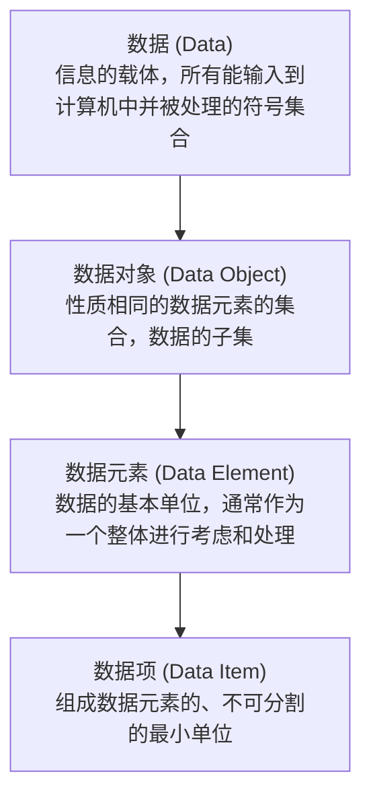

# 数据结构期末考试复习精要

## 第一章 绪论与算法分析

### 1. 数据结构的基本概念

#### 1.1 数据概念的层次关系
数据结构中，数据相关的概念存在着由宏观到微观的层层包含关系。其关系可以表示为：
**数据 (Data) $\rightarrow$ 数据对象 (Data Object) $\rightarrow$ 数据元素 (Data Element) $\rightarrow$ 数据项 (Data Item)**



*   **数据 (Data)**：是客观事物的符号表示，是所有能输入到计算机中并被计算机程序处理的符号的总称。
*   **数据对象 (Data Object)**：是性质相同的数据元素的集合，是数据的一个子集。例如，整数数据对象是集合 $C = \{0, \pm1, \pm2, \dots\}$。
*   **数据元素 (Data Element)**：是数据的**基本单位**，在计算机程序中通常作为一个整体进行考虑和处理。一个数据元素可由若干个数据项组成（例如：学生表中，一个学生记录就是一个数据元素）。
*   **数据项 (Data Item)**：是组成数据元素的、**不可分割的最小单位**（例如：学生记录中的学号、姓名、性别等）。

---

#### 1.2 数据结构的三要素
数据结构是指相互之间存在一种或多种特定关系的数据元素的集合，它包括以下三个方面：

##### 1. 逻辑结构（面向问题）
逻辑结构独立于计算机，描述的是数据元素之间的逻辑关系。主要分为：
*   **集合结构**：结构中的数据元素除了“同属于一个集合”的关系外，别无其他关系。
*   **线性结构**：结构中的数据元素之间存在一对一的关系。若结构非空，则有且仅有一个开始结点和一个终端结点，其余每个结点都有且仅有一个直接前驱和直接后继。
    *   *典型代表*：线性表、栈、队列、串。
*   **非线性结构**：结构中的数据元素之间存在一对多或多对多的关系。
    *   **树形结构**：一对多。
    *   **图形结构/网状结构**：多对多。

##### 2. 存储结构（物理结构，面向计算机）
存储结构是逻辑结构在计算机中的表示（又称映像），主要有以下四种方式：
*   **顺序存储**：把逻辑上相邻的元素存储在物理位置上也相邻的存储单元中，结点间的关系由存储单元的邻接关系来体现。
    *   *特点*：**随机存取**（可以根据起始地址和元素序号直接计算出对应地址并在 $O(1)$ 时间内访问），存储密度高，但插入、删除操作需要移动大量元素，且需要一片连续的存储空间。
*   **链式存储**：不要求逻辑上相邻的元素在物理位置上也相邻，结点间的逻辑关系由附加的指针字段表示。
    *   *特点*：**顺序存取**（要访问某个结点，必须从头指针开始逐个往后查找），插入和删除操作方便，不需要连续的空间，但指针占用额外空间，存储密度较低。
*   **索引存储**：在存储元素信息的同时，还建立附加的索引表。索引表中的每项称为索引项，一般形式是（关键字，地址）。
    *   *特点*：检索速度快，但增加了索引表，占用较多的存储空间，并且在插入和删除数据时需要修改索引表，时间开销较大。
*   **散列存储（哈希存储）**：根据元素的关键字直接计算出该元素的存储地址。
    *   *特点*：检索、增加、删除操作非常快，但容易产生冲突，需要专门的冲突解决机制。

> [!IMPORTANT]
> **考试核心考点 (易混淆概念)**
> *   **顺序存储**支持**随机存取 (Random Access)**，而**链式存储**仅支持**顺序存取 (Sequential Access)**。
> *   同一逻辑结构可以采用不同的存储结构，但逻辑结构与具体的计算机硬件和物理实现无关，而存储结构则依赖于计算机。

##### 3. 数据的运算
包括运算的定义和实现。运算的定义是针对逻辑结构的，指出运算的功能；运算的实现是针对存储结构的，指出运算的具体操作步骤。

---

#### 1.3 数据类型与抽象数据类型
*   **数据类型 (Data Type)**：是一个值的集合和定义在此集合上的一组操作的总称。它强调的是**具体现实实现**（如 C 语言中的 `int`, `float`, `char` 等）。
*   **抽象数据类型 (Abstract Data Type, ADT)**：是指一个数学模型以及定义在该模型上的一组操作。它只取决于它的**逻辑特性**，而与它在计算机中的具体表示和实现无关。ADT 强调的是**逻辑定义**，目的是为了提高软件复用性、模块化和抽象性。

---

### 2. 算法与算法分析

#### 2.1 算法的定义与 5 大特性
**算法 (Algorithm)** 是对特定问题求解步骤的一种描述，它是指令的确定序列。

##### 算法的 5 大特性
1.  **有穷性 (Finiteness)**：算法必须在执行有穷步之后结束，且每一步都可在有穷时间内完成。
2.  **确定性 (Definiteness)**：算法中每条指令必须有确切的含义，对于相同的输入只能得出相同的输出，不能产生二义性。
3.  **可行性 (Feasibility)**：算法中描述的操作都可以通过已经实现的基本运算执行有限次来实现。
4.  **输入 (Input)**：一个算法有**零个或多个**输入。
5.  **输出 (Output)**：一个算法有**一个或多个**输出。

> [!WARNING]
> **判断题常见陷阱 (避坑指南)**
> 1.  **算法 $\neq$ 程序**：**算法**必须是有穷的，而**程序**可以是无穷的（例如：操作系统的循环监听程序、Web 服务器后台守护进程是程序而非算法，因为它们在不人为干扰的情况下可以无限运行）。
> 2.  **输入与输出的限制**：算法可以**没有输入**（例如，直接在屏幕上打印 "Hello World" 的算法，输入数为 0），但算法**必须有输出**。没有输出的算法是没有实际意义的。

##### 算法的评判标准
*   **正确性 (Correctness)**：算法能够正确地解决问题。
*   **可读性 (Readability)**：算法应当便于人们理解和交流，有助于调试和修改。
*   **健壮性 (Robustness)**：当输入数据非法时，算法能够做出适当的反应或进行处理，而不会产生莫名其妙的输出或系统崩溃。
*   **高效性 (Efficiency)**：包括时间效率（时间复杂度低）和空间效率（空间复杂度低）。

---

### 3. 时间复杂度计算专项指南

#### 3.1 常见时间复杂度大小排序
在算法分析中，我们使用大 $O$ 记号来描述算法的时间渐进复杂度。常见的时间复杂度按从小到大（效率由高到低）的排序为：

$$O(1) < O(\log_2 n) < O(n) < O(n \log_2 n) < O(n^2) < O(n^3) < O(2^n) < O(n!)$$

*   $O(1)$：常数阶
*   $O(\log_2 n)$：对数阶
*   $O(n)$：线性阶
*   $O(n \log_2 n)$：线性对数阶
*   $O(n^2)$：平方阶
*   $O(n^3)$：立方阶
*   $O(2^n)$：指数阶
*   $O(n!)$：阶乘阶

---

#### 3.2 常见循环时间复杂度分析例题与步骤

##### 例 1：单重循环自增型（线性阶）
```cpp
void fun1(int n) {
    int count = 0;
    for (int i = 0; i < n; i++) {
        count++; // 基本语句
    }
}
```
*   **分析步骤**：
    1.  确定算法中的基本操作语句：`count++;`。
    2.  设循环体执行次数为 $t$。由循环控制条件 `i < n` 且 `i` 从 0 开始每次自增 1，可以得出第 $t$ 次循环时，变量 `i` 的值为 $t-1$。
    3.  循环终止条件为 $i \ge n$，即 $t \ge n$ 时循环结束。因此，最大循环次数为 $t = n$。
    4.  基本操作的执行次数为 $n$，因此时间复杂度为 $O(n)$。

##### 例 2：倍增/倍减型循环（对数阶）
```cpp
void fun2(int n) {
    int i = 1;
    while (i < n) {
        i = i * 2; // 基本语句
    }
}
```
*   **分析步骤**：
    1.  基本操作为 `i = i * 2;`。
    2.  设循环执行次数为 $t$，初始时 $i = 1$。
        *   第 1 次循环结束：$i = 1 \times 2 = 2^1$
        *   第 2 次循环结束：$i = 2 \times 2 = 2^2$
        *   第 3 次循环结束：$i = 4 \times 2 = 2^3$
        *   ……
        *   第 $t$ 次循环结束：$i = 2^t$
    3.  循环终止条件为 $i \ge n$，即当 $2^t \ge n$ 时循环退出。
    4.  取对数可得 $t \ge \log_2 n$。由于 $t$ 必须是整数，故循环执行次数 $t = \lceil\log_2 n\rceil$。
    5.  因此，时间复杂度为 $O(\log_2 n)$（常写为 $O(\log n)$）。

##### 例 3：双重循环嵌套关联型（平方阶）
```cpp
void fun3(int n) {
    int count = 0;
    for (int i = 0; i < n; i++) {
        for (int j = 0; j < i; j++) {
            count++; // 基本语句
        }
    }
}
```
*   **分析步骤**：
    1.  基本操作是内层循环中的 `count++;`。
    2.  内层循环的执行次数依赖于外层循环变量 `i` 的值：
        *   当 `i = 0` 时，内层循环执行 0 次；
        *   当 `i = 1` 时，内层循环执行 1 次（$j = 0$）；
        *   当 `i = 2` 时，内层循环执行 2 次（$j = 0, 1$）；
        *   ……
        *   当 `i = n-1` 时，内层循环执行 $n-1$ 次。
    3.  因此，总执行次数 $T(n)$ 为内层所有执行次数的累加：
        $$T(n) = \sum_{i=0}^{n-1} i = 0 + 1 + 2 + \dots + (n-1) = \frac{n(n-1)}{2} = \frac{1}{2}n^2 - \frac{1}{2}n$$
    4.  在大 $O$ 记号中，仅保留主导项（最高阶项）并忽略其常数系数。
    5.  主导项为 $n^2$，因此时间复杂度为 $O(n^2)$。

---

### 4. 空间复杂度分析

#### 4.1 空间复杂度的定义
**空间复杂度 (Space Complexity)** 是对一个算法在运行过程中**临时占用存储空间大小**的量度，记作 $S(n) = O(f(n))$，其中 $n$ 为问题的规模。

算法占用的存储空间通常包括：
1.  程序代码本身占用的空间。
2.  输入数据占用的空间（由问题本身决定，不计入算法的空间复杂度）。
3.  **辅助变量占用的空间（这是空间复杂度分析的核心目标）**。

#### 4.2 原地工作与空间复杂度分析

*   **原地工作 (In-place operation)**：指算法在运行过程中辅助空间的大小为常数，即空间复杂度为 $O(1)$。这表明算法所需的额外空间不随输入规模 $n$ 的改变而改变。
*   **随输入规模增加的空间复杂度**：
    *   **一维数组开辟**：若算法中为了辅助计算，需要动态分配一个大小与输入规模 $n$ 相关的数组（如 `int* temp = new int[n]`），则其空间复杂度为 $O(n)$。
    *   **递归调用栈空间**：递归算法在执行时，系统会为每一层递归调用在栈中分配活动记录（包括局部变量、返回地址 and 形参等）。
        *   *例子*：单路递归斐波那契数列或者递归阶乘计算，递归的深度为 $n$，则系统递归栈的深度为 $n$，因此空间复杂度为 $O(n)$。
        *   如果递归深度是 $\log_2 n$（例如二分查找的递归实现），则空间复杂度为 $O(\log n)$。
